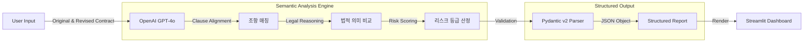

# Semantic Contract Diff: 지능형 계약서 비교 분석 시스템

## 1. 프로젝트 개요
본 프로젝트는 기존의 텍스트 기반 비교 도구(Text Diff Tool)가 가진 한계를 극복하기 위해 개발된 **Legal Tech(리걸테크) 솔루션**입니다.

계약서의 수정 과정에서 발생하는 변경 사항을 단순히 문자열의 차이로 인식하지 않고, **GPT-4o의 추론 능력**을 활용하여 **법적 효력의 변화와 리스크(Risk)**를 분석합니다. 이를 통해 법무 담당자는 문맥 속에 숨겨진 독소 조항이나 불리한 변경 사항을 즉각적으로 식별할 수 있습니다.

### 핵심 해결 과제
* **Syntactic vs Semantic:** 단어의 순서나 표현만 바뀐 경우(무의미한 변경)와, 단어 하나로 책임 소재가 뒤바뀐 경우(중대한 변경)를 구분.
* **Risk Assessment:** 변경된 조항이 '을(수급사)'의 입장에서 얼마나 치명적인지 3단계(High/Medium/Low)로 등급화.

## 2. 시스템 아키텍처

비정형 텍스트인 계약서를 입력받아, Pydantic v2를 통해 엄격하게 정의된 스키마(Schema)로 구조화된 데이터를 산출하는 파이프라인입니다.



## 3. 기술 스택
* **Language**: Python 3.10+

* **LLM**: OpenAI gpt-5-mini (Reasoning & Extraction)

* **Framework**: LangChain

* **Data Validation**: Pydantic v2 (Structured Output)

* **UI**: Streamlit

## 4. 주요 기능
### 4.1. 구조화된 데이터 추출 (Structured Output)
LLM의 출력을 단순 텍스트가 아닌 Python 객체로 강제합니다. pydantic 라이브러리를 사용하여 조항명, 원문, 수정문, 리스크 등급, 분석 내용을 필드별로 정확하게 파싱합니다.

### 4.2. 의미론적 비교 (Semantic Comparison)
두 계약서의 조항 번호가 달라지거나(예: 제5조 -> 제6조), 문장 구조가 완전히 바뀌어도 내용상 대응되는 조항을 찾아 비교합니다.

### 4.3. 리스크 자동 등급화
변경된 내용이 사용자에게 미치는 법적 영향을 분석하여 리스크 수준을 분류합니다.

* **High**: 배상 책임의 무제한 확장, 해지 권한의 일방적 변경 등.

* **Medium**: 모호한 표현의 추가, 절차적 복잡성 증가.

* **Low**: 단순 용어 변경, 명확성 개선.

## 5. 설치 및 실행 가이드
### 5.1. 환경 설정
```bash
git clone [repository url]
pip install -r requirements.txt
```
### 5.2. 환경 변수 설정
프로젝트 루트에 .env 파일을 생성합니다.

```bash
OPENAI_API_KEY=sk-...
```
### 5.3. 실행
```bash
streamlit run main.py
```